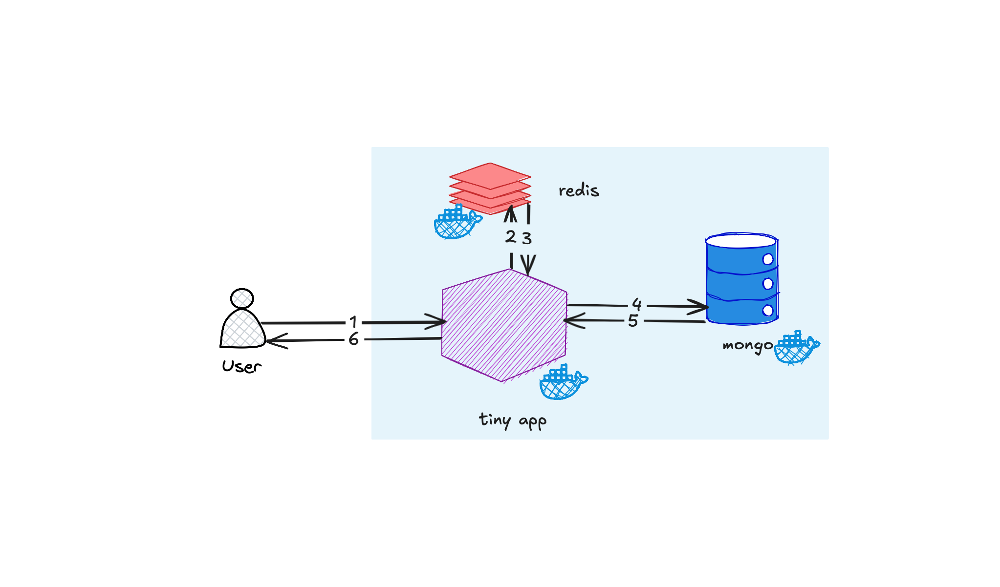

# Another Tiny URL Service

This project is a simple URL shortening service, allows users to create short URLs from long URLs, providing a convenient way to share links.

## Features

-   **URL Shortening:** Converts long URLs into shorter, more manageable links.
-   **Redirection:** Redirects users from the short URL to the original long URL.
-   **Cache:** Uses Redis to cache frequently accessed URLs for faster redirection.
-   **Persistence:** Stores URL mappings in MongoDB for persistent storage.

## Technologies Used

**[Node.js](https://nodejs.org/)** | **[Express](https://expressjs.com/)** | **[TypeScript](https://www.typescriptlang.org/)** | **[Redis](https://redis.io/)** | **[MongoDB](https://www.mongodb.com/)** | **[Docker](https://www.docker.com)**



## Getting Started

### Prerequisites

-   Docker desktop installe din your machine

### Installation

1.  Clone the repository:

    ```bash
    git clone <repository_url>
    cd another-tiny-url/server
    ```
2.  Build docker image:

    ```bash
    docker compose build
    ```

3.  Start the servers:

    ```bash
    docker compose up
    ```

### Configuration

1.  Set up environment variables:

    Use `.env` file in the root directory and modifiy the values accordingly:

    ```
    MONGO_ROOT_USERNAME=root1
    MONGO_ROOT_PASSWORD=password1
    MONGO_DEV_USER=devUser1
    MONGO_DEV_PASSWORD=devPassword1
    MONGO_INITDB_DATABASE=tinyurlDB
    ```

    Replace above with your MongoDB credentials and database name.


## API Endpoints

-   **GET /**:
    -   Returns a welcome message.
    -   Example: `http://localhost:3000/`

-   **GET /:tinyHash**:
    -   Redirects to the original URL based on the short hash.
    -   Example: `http://localhost:3000/xyz123`

-   **POST /create**:
    -   Creates a new short URL.
    -   Requires a JSON payload with the `url` field.
    -   Example:

        ```bash
        curl -X POST http://localhost:3000/create \
          -H "Content-Type: application/json" \
          -d '{"url": "https://www.example.com"}'
        ```
